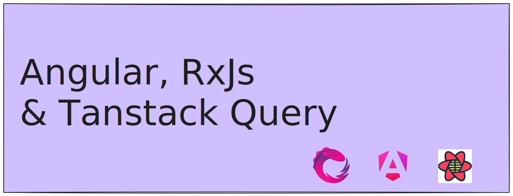

# Zašto je HTTP sloj u vašoj Angular aplikaciji loš?



Radionica prati [članak koji sam napisao na istu temu.](https://jerkic.dev/hr/blog/angular-data-loading/)

https://github.com/markojerkic/angular-data-fetching-workshop/tree/
Primljeno je više grana koje predstavljaju različite korake radionice.
-  [1-rezultat-upita-kao-property-razreda](https://github.com/markojerkic/angular-data-fetching-workshop/tree/1-rezultat-upita-kao-property-razreda)
-  [2-indikatori-učitavanja-i-grešaka](https://github.com/markojerkic/angular-data-fetching-workshop/tree/)
-  [3-promjena-rute](https://github.com/markojerkic/angular-data-fetching-workshop/tree/3-promjena-rute)
-  [4-nezeljene-nuspojave](https://github.com/markojerkic/angular-data-fetching-workshop/tree/4-nezeljene-nuspojave)
-  [5-tanstack-query](https://github.com/markojerkic/angular-data-fetching-workshop/tree/5-tanstack-query)
-  [6-infinite-query](https://github.com/markojerkic/angular-data-fetching-workshop/tree/6-infinite-query)
-  [7-poboljsanja](https://github.com/markojerkic/angular-data-fetching-workshop/tree/7-poboljsanja)

## Kako pokrenuti radionicu?

Za backend dio sam iskoristio [Bun](https://bun.sh), ali samo zato jer sam lijen bio da koristim Node fs API.

Ili instalirajte [Bun](https://bun.sh), pa `bun install && bun dev`, ili zamijenite `getFavouritePokemon` i `setFavouritePokemon` funkcije da koriste Node fs API.

```ts
import { writeFile, readFile } from 'fs/promises';

async function setFavouritePokemon(pokemon: string): Promise<void> {
  return writeFile('favourite.json', JSON.stringify({ favourite: pokemon }));
}
async function getFavouritePokemon(): Promise<string> {
  const data = await readFile('favourite.json', 'utf-8');
  return JSON.parse(data).favourite;
}
```

Nažalost, previše sam lijen da to ispravim sada na svih 7 grana.

Ako ipak zamijenite implementaciju funkcija, možete koristiti `npm install && npm run dev` za pokretanje aplikacije.
